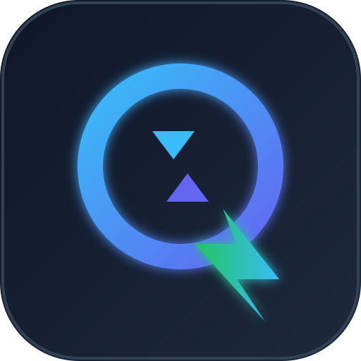

# QuickTrace — Instant Translation for Windows



> **QuickTrace** is a lightweight Windows translation app designed for instant text translation across desktop workflows, gaming, clipboard-based translation, and configurable translation engines.

[](https://github.com/mephisto-mert/translation)
[](https://flutter.dev)
[](https://github.com/mephisto-mert/translation/releases/tag/v1.0.0)
[](LICENSE)

---

## 📥 Download

Download the latest standalone portable release for Windows x64:

👉 **[Download QuickTrace v1.0.0 (Windows x64 ZIP)](https://github.com/mephisto-mert/translation/releases/download/v1.0.0/QuickTrace-Windows-x64-v1.0.0.zip)**

**Checksum (SHA-256):**
```text
3e4105874d727a6e0a6bac93b6d5a83bb7d271aa274dd352e9c379a87d742cdd  QuickTrace-Windows-x64-v1.0.0.zip
```

---

## ✨ Key Features

- **Instant Keyboard Input Translation**: Real-time input mode buffers keystrokes and replaces text in-place when pressing trigger keys (`.`, `!`, `?`, `,`, or `Enter`).
- **Mouse Hover Bubble Mode**: Floating translation tooltip appears near the mouse cursor when text is selected in any desktop application.
- **Clipboard Translation Monitor**: Automatically translates text copied to the Windows clipboard and presents desktop notifications.
- **Multi-Engine Fallback Pipeline**: Intelligently routes requests through Google Gemini 2.0 Flash, DeepL API, Google Translate (GTX), and MyMemory with automatic failover and rate-limit cooldowns.
- **Gaming Glossary Term Protection**: Protects CS2 and competitive gaming terms (e.g., *A site*, *B site*, *AWP*, *Rush*, *Eco*, *Rotate*, *Clutch*) from machine translation corruption using collision-resistant placeholders.
- **Punctuation & Slang Transformer**: Preserves URLs, emails, Windows file paths, decimals, and converts literal slang into natural gamer English.
- **Bounded LRU Cache**: 500-entry memory-bounded cache with SHA-256 keys, automatic corruption recovery, and debounced disk persistence via `SharedPreferences`.
- **Hardware DirectInput ScanCodes**: Low-level C++ Win32 hook engine (`SendInput` with `KEYEVENTF_SCANCODE`) compatible with full-screen games (CS2, Valorant, GTA V).
- **Secure API Key Storage**: API credentials stored using Windows Data Protection API (DPAPI) via `flutter_secure_storage`.
- **Target Window Focus Verification**: `ForegroundWindowService` HWND/PID validation prevents accidental text injection when switching windows.

---

## 🌐 Supported Translation Engines

| Provider | Status | API Key Required | Notes |
| :--- | :--- | :--- | :--- |
| **Google Translate (GTX)** | Active (Default) | No | Fast, zero-config endpoint for general translation |
| **Google Gemini 2.0 Flash** | Active | Yes | AI-powered natural translation with slang context |
| **DeepL API** | Active | Yes | High-precision formal & casual translation |
| **MyMemory** | Active (Fallback)| No | Public fallback engine when other engines hit limits |

---

## 🎮 Gaming Translation

QuickTrace is optimized for PC gamers requiring fast in-game chat translation without interrupting gameplay:

- **CS2 & Tactical Shooter Compatibility**: Uses low-level C++ DirectInput scancodes so backspace deletion and simulated paste operate smoothly inside full-screen DirectX/Vulkan games.
- **Custom Glossary Support**: Add custom team terms and callouts to prevent translation engines from misinterpreting gaming acronyms.
- **Slang Smoothing**: Converts literal Turkish/English chat phrases (e.g., *"tamam geliyorum"*) into authentic gaming English (*"Got it, on my way bro!"*).

---

## 🔒 Security & Privacy

- **Local Storage**: Preferences, glossary terms, translation history, and cache entries are stored locally on your machine.
- **Credential Protection**: API keys are encrypted using Windows DPAPI via `flutter_secure_storage` and never committed or transmitted to third parties except the respective translation provider APIs.
- **External Data Transmission**: Selected text is transmitted directly to the active translation engine (Google Gemini, DeepL, Google Translate, or MyMemory) over HTTPS depending on your selected engine settings.

---

## 🛠️ Building from Source

### Prerequisites
- [Flutter SDK](https://docs.flutter.dev/get-started/install) (v3.19+ recommended)
- Visual Studio 2022 with **Desktop development with C++** workload
- Git

### Build Steps

```bash
# Clone the repository
git clone https://github.com/mephisto-mert/translation.git
cd translation/flutter_app

# Install Dart & Flutter dependencies
flutter pub get

# Run static analysis
dart analyze

# Run unit and widget tests
flutter test

# Build executable for Windows
flutter build windows --release
```

The compiled release executable will be located at:
`flutter_app/build/windows/x64/runner/Release/QuickTrace.exe`

---

## 📁 Repository Structure

```text
translation/
├── .github/
│   └── workflows/
│       └── release.yml            # CI/CD GitHub release workflow
├── assets/
│   └── branding/                  # SVG logos and visual assets
├── dist_release/                  # Staging directory for distributable
├── flutter_app/
│   ├── lib/
│   │   ├── constants/             # Application locales & UI colors
│   │   ├── controllers/           # Application state controllers
│   │   ├── models/                # Translation models & results
│   │   ├── services/              # Core translation, cache, glossary, & native hooks
│   │   └── widgets/               # UI components & settings cards
│   ├── test/                      # Unit and widget test suites
│   ├── windows/                   # Win32 C++ runner & native hook implementation
│   └── pubspec.yaml               # Flutter package configuration
├── legacy_python_prototype/       # Archived Python prototype scripts
├── CHANGELOG.md                   # Project version changelog
├── LICENSE                        # MIT License
├── README.md                      # Primary project sitemap & documentation
└── SHA256SUMS.txt                 # Release archive checksums
```

---

## 📄 License

Distributed under the MIT License. See `LICENSE` for more information.
